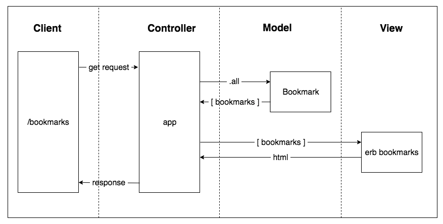

# bookmark_manager

#### Makers Academy - Week 4 Pair Programming Challenge

#### Tech used - HTML, Sinatra, Capybara, Ruby, RSpec, PostgreSQL

#### Task instructions

You're going to build a bookmark manager. A bookmark manager is a website to maintain a collection of bookmarks (URLs). You can use it to save a webpage you found useful. You can add tags to the webpages you saved to find them later. You can browse bookmarks other users have added. You can comment on the bookmarks.

#### User Stories
```
As a user
So that I can have quick access to my favourite websites
I would like to see a list of bookmarks.

As a user
So that links I discovered recently can be saved in my bookmark list
I can add a new bookmark

As a user
So that sites I no longer visit regularly can be removed
I can delete a bookmark from my list

As a user
So that changes in the URL can be reflected in my bookmarks
I can update an existing bookmark

As a user
So that I can keep track of my thoughts 
I can add a comment to an existing bookmark

As a user
So that I can make changes to my notes about a bookmark
I can update a comment to an existing bookmark

As a user
So that I can remove an existing note  
I can delete a comment from an existing bookmark

As a user
So that I can group my existing bookmarks
I can add tag bookmarks into categories

As a user
So that I can see only links I am interested in
I can filter my existinging categories

As a user
So that I can manage my bookmarks only
I can modify bookmarks I own

```

#### Domain Model
```


```

#### To set up the database

Connect to `psql` and create the `bookmark_manager` and `bookmark_manager_test` databases:

```
CREATE DATABASE bookmark_manager_test;
```
To set up the appropriate tables, connect to each database in `psql` and run the SQL scripts in the `db/migrations` folder in the given order.